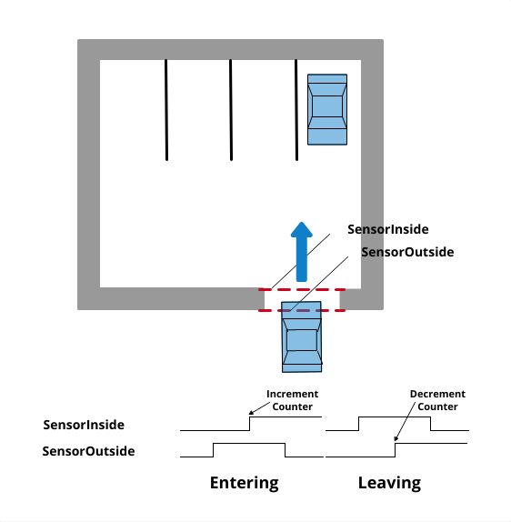
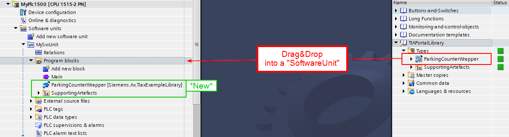

# Example Library for Demonstrating the "TIAX - Library" Use Case

## Description

This simple sample library provides functionalities to determine the parking space occupancy of a car park. The project is specifically designed for a use case in TIA Portal, leveraging the "TIAX" workflow.



## Understanding the "TIAX - Library" Workflow

The "TIAX - library" use case involves creating a library (of type "lib") within SIMATIC AX and then exporting its contents to a TIA Portal Global Library. This allows for later reuse within TIA Portal. The TIA Portal Global Library will retain the "typed" nature of your FCs, FBs, Classes, and so on, enabling you to utilize all TIA Portal's library features, including central updates across your projects.

## Creating Your Project from This Template

Please use a CLI terminal for the following steps:

1.  Log in to SIMATIC AX:

    ```sh
    apax login
    ```

2.  Log in to GitHub:

    ```sh
    apax login --registry "https://npm.pkg.github.com/" --password YOUR-GH-ACCESS-TOKEN
    ```
    `YOUR-GH-ACCESS-TOKEN` can be created in your GitHub account settings.

3.  Navigate to your desired project path

4.  Create a new project based on this application-example template.

    ```sh
    apax create @simatic-ax/ae-counter-tiax --registry https://npm.pkg.github.com ae-counter-tiax
    ```

## Software Blocks

### Counter

A generic `Counter` class designed for counting both upwards and downwards.

### ParkingCounter

The `ParkingCounter` class calculates the filling level (occupancy) of the car park based on a sequence of sensor signals.

This class utilizes two input sensors:
*   `BSensorInside`
*   `BSensorOutside`

The counter value will be incremented or decremented depending on the order in which these signals are activated.

Example for entering the car park:
If `SensorOutside` is activated first, followed by `SensorInside`, the counter will be increased by one.

### ParkingCounterFB

A TIA Portal compatible `ParkingCounterFB` that acts as a wrapper function block. It internally uses the `ParkingCounter` class.

## Steps to Create the TIA Portal Global Library

1.  Open the project in AX-Code.

2.  Install project dependencies.
    
    Use the AX Code CLI terminal.

    ```sh
    apax install
    ```

3.  Adjust the TIA Portal install path

    Modify the `TIA_INSTALL_PATH` variable within your `apax.yml` file to match your TIA Portal installation and version.

    ```yaml
    TIA_INSTALL_PATH: "C:\\Program Files\\Siemens\\Automation\\Portal V20"
    ```

4.  Create the TIA Portal Library:

    ```sh
    apax create-tialib
    ```

    The Global Library will be saved in the `./TIAPortalLibrary` directory.

5.  Create or open an existing TIA Portal project.

6.  Open the Global Library in TIA Portal.

7.  Call the `ParkingCounterWrapper` block in your application.

    

## Contribution

Thank you for your interest in contributing! We welcome your feedback. Please feel free to report bugs, suggest improvements, clarify documentation, and highlight any other issues regarding this repository in the "Issues" section. Even better, we encourage you to propose changes to this repository using "Merge Requests." Our designated CODEOWNERS will review and address them.

Happy coding!

🐱‍💻 BEEP, BOOP, BEEP, BEEP, BOOP 🐱‍🏍