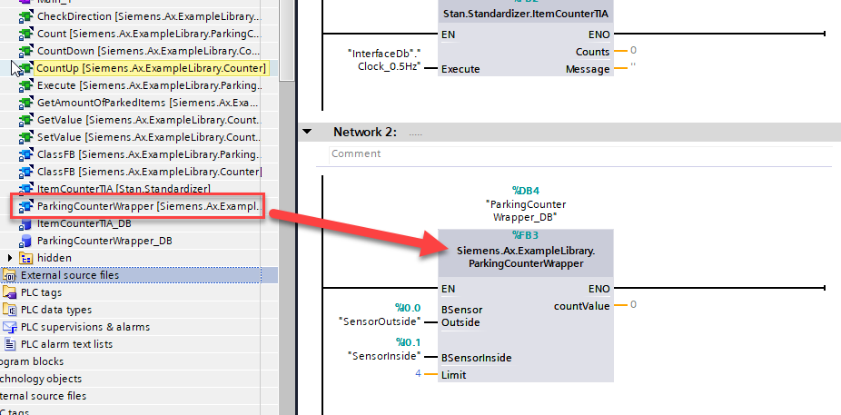

# Example library for demonstrating the "TIAX - library" use case

## Explaination "TIAX - library"

In the "TIAX - library" use case you create a library (type: "lib") within SIMATIC AX and export the contents towards a TIA Portal Global-library for later reuse in TIA Portal. With that being said the TIA Portal Global-library will hold the FC's, FB's, Classes etc. in it's "typed" nature, so you will be able to make use of all the library features within TIA Portal including central updates accross your project.  

## Description of this example Library

This sample library contains suitable functionalities for determining the parking space occupancy of a car park. 


## Create your project from this template

1. If not done yet: 
   
   Login to **SIMATIC AX**

    ```sh
    apax login
    ```

    Login to the **GitHub**

    ```sh
    apax login --registry "https://npm.pkg.github.com/" --password YOUR-GH-ACCESS-TOKEN
    ```

2. Create the TIA Portal Library

    ```sh
    apax create-tialib
    ```


## Software blocks

### Counter

Generic `Counter` class for counting upwards and downwards.

### ParkingCounter

Class `ParkingCounter` counts the filling level of the car park depending on the above described sensor signal sequence.

This class has two input sensors:
- BSensorInside
- BSensorOutside

Depending in which order the signals are occupied, the counter-value will be incremented or decremented.

Example for entering the car park:
First will the SensorOutside occupied and then SensorInside. In this case, the counter will be increased by one. 

### ParkingCounterFB

TIA Portal compatible `ParkingCounterFB` which acts as wrapper `function block`. It uses internally the class `ParkingCounter`

_Maybe a link what a wrapper FB is ?_ 
_How does a wrapper work? Also link to explanation_

## Steps to create the TIA Portal Global Library

    The Global Library will be stored in ./bin/TIAPortalLibrary

1. Create or open an existing TIA Portal project

1. Open the Global Library in TIA Portal

1. Call the Block `ParkingCounterWrapper` in your application

    


## Used features in this application example

### ST features
- Namespaces
- Enumeration
- Class & Methods 
- Call of private methods (THIS-Operator)
- Definition and implementation of interfaces (INTERFACE/IMPLEMENTS)
- Access modifier (PRIVATE/PUBLIC)

### UnitTesting
- Test fixture
- Test method
- Assertions

### AX Code Features
- Snippets
